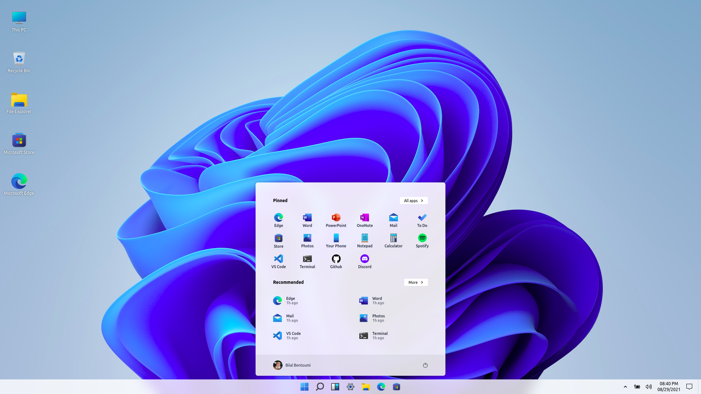
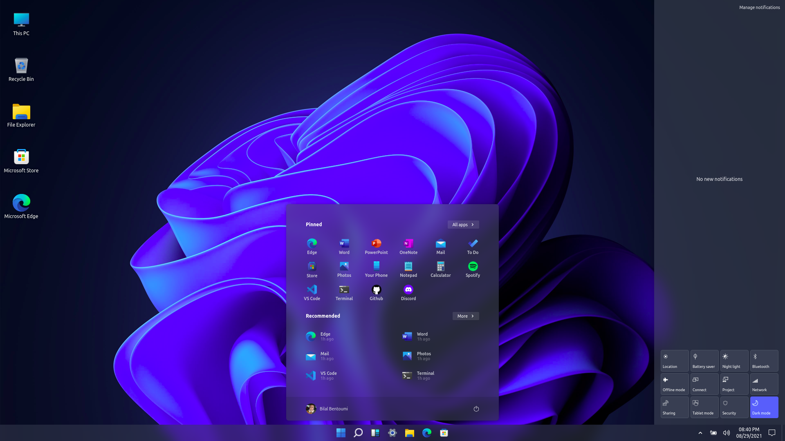

# Windows 11 - Vue.js
Windows 11 simulator built with modern web technologies, Vue.js for the main framework, Tailwind as css framework, Vuex, Scss..

## Live Demo
[https://bilalbentoumi.github.io/win11-vue](https://bilalbentoumi.github.io/win11-vue)

For better experience use Google Chrome browser.

Blur not working in Firefox browser.

## Screenshots
 

## Features
- Light / Dark modes
- Start menu
- Notification center

## Technologies
- Vue.js v3
- Tailwind CSS
- Vuex

## License
CC0-1.0 License